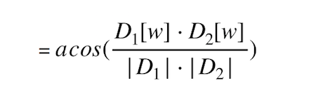
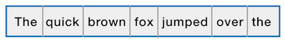

# Assignment1
Due: Jan 28, 11:15p

## Preface

Welcome to ECE180!  We’re really excited that you’ve decided to join us for our inaugural voyage.  We sure hope you have as much fun taking this class as we’re having developing it!  Naturally, we want you to really grow in the areas of software development and C++.  

### On Writing Code

You’re going to be writing and debugging lots of code in this class. In nearly every case, we have two objectives in mind: 1) to give you experience with the many new idioms in Object-oriented development with C++; and 2) to help you to learn to think like a software developer. 

As important as learning the C++ language may be, we believe that it’s even more important that you learn the conceptual language of software design.  How you think about the problems you’ll face is often the most important factor in whether you can craft a software solution.  

Take time to reflect on these assignments, and consider the larger concepts — before you start writing any code.  Remember that a fundamental advantage of object-oriented programming is that these techniques allow us to more easily reason about the problem space.  So, take some time to consider the relationships between key elements in the problem space, and how you might synthesize them into a working model.  During this phase, it’s a great idea to chat with peers and instructors on concepts you’re working through. Software design is a team sport.

## Overview

In this assignment you will be reading data from files, processing and storing the file contents, processing and comparing the contents, and writing the results back to output files.  If you worked for a bank, this standard input-output process would be referred to by the acronym ETL (Extract, Transform, Load).  ETL may be the most common process patterns you’ll see.
The file processing component for this assignment will be rather mundane, apart from the fact that we’ll be using C++ streams. It’s the processing part of this assignment that is interesting. 

### Measuring Similarity Between Documents

Plagiarism is a rampant issue, in the arts, education, and even in politics. In order to thwart plagiarism, many techniques have been developed and tried. CRC32 computes a numeric fingerprint for a document; cool but not what we need.  In this assignment we’ll use a technique called, “document distance”, which uses a vector-based “distance” function.  This method can be used to trivially determine closely related to documents may be. If the distance is 0, it suggests that the documents are identical, and you’ve caught someone trying to cheat.

Let’s define a “document” as a collection of words, similar to this document. Words comprise the collection of letter+number sequences, separated by whitespace or other punctuation. We can describe the collection of words (w) in a document (D) by using a vector, where D[w] = number of occurrences of w in D. See diagram above for a visualization of two vectors (“some bread” vs “some cheese”).  Since we’ve mapped words in our documents into vector-space, it’s trivial to compute a distance using the dot-product. By that method, we can formulate a simple equation to measure the distance as:

If the resulting angle of all this is 0, then the documents are equal. If the angle is 90 degrees, the documents are completely different.  Advances in document processing are relatively new; many of these algorithms have been developed in the last 30 years or so. As our goal is to learn to write better code in C++, it’s time to move on to the implementation.

### Assembling a list of bi-grams

Imagine that we were to transcribe all the words in a document on to a piece of tape in sequential order. It would look something like this:

Bi-grams are word-pairs. The bi-grams in a sentence is the set of word-pairs we encounter as we iterate the sentence in reading order (left-to-right in English). In our example, the first three word-pairs are:  “The quick”, “quick brown”, “brown fox”, and so on. 

### A Quick Word on JSON

In part 2 of your assignment, you are expected to generate a json formatted text file. JSON is a lightweight text-based data interchange format derived from javascript.  JSON files contain an ordered list of key-value pairs, making it an natural format for encoding ordered collections. For example, I can encode the list of my favorite types of fruit into json like this:

{
    "fruit": "Apple",
    "size": "Large",
    "color": "Red"
}

You’ll discover that json files make it just as easy to encode hierarchical data collections as well.  You can learn more about JSON here:

https://developer.mozilla.org/en-US/docs/Learn/JavaScript/Objects/JSON 

http://www.json.org

